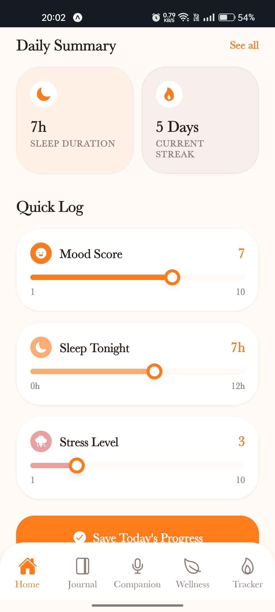
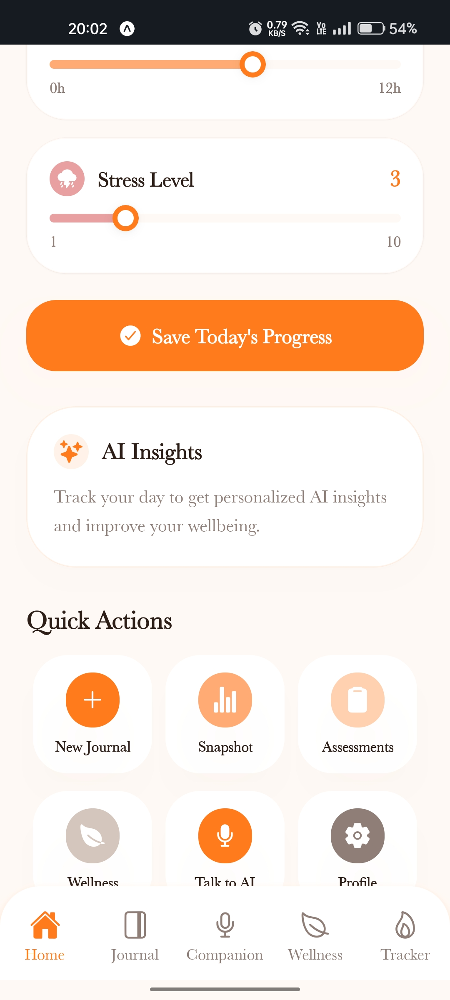
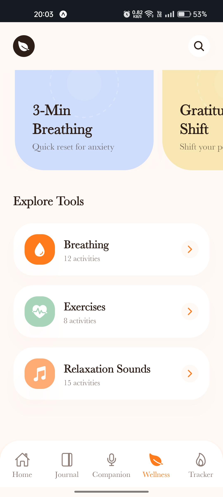
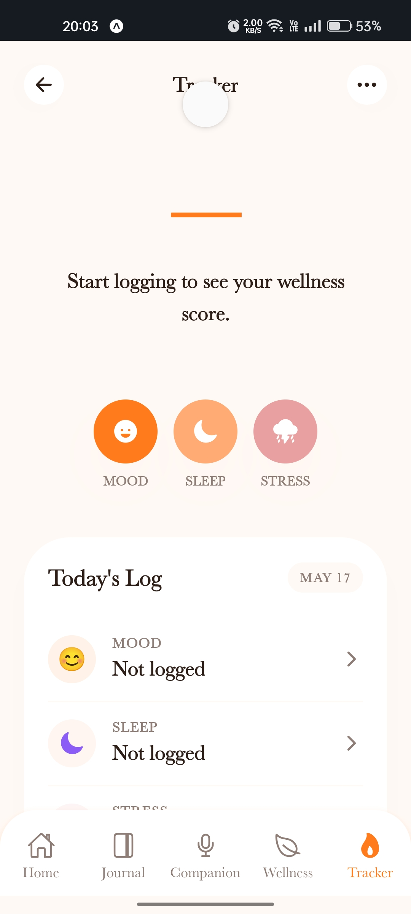

# 🌙 MoonDiary

**MoonDiary** is a modern, AI-powered and privacy-focused journaling app — built with **Expo**, **NativeWind**, and **Supabase**.  
It helps users securely record their thoughts, reflect daily, and get smart insights powered by AI — all while keeping data safe and private.

---

## ✨ Features

- 🧠 **AI Reflection Assistant** — Get personalized summaries and emotional insights.
- 🔒 **Secure Storage** — Your journal is encrypted and safely stored using Supabase.
- 🪶 **Minimal & Smooth UI** — Built with Expo + NativeWind for a fast, native experience.
- ☁️ **Cloud Sync** — Access your journal anytime, anywhere.
- 🌑 **Dark Mode Support** — Perfect for late-night reflections.

---

## 📱 Screenshots

<table>
  <tr>
    <td></td>
    <td></td>
  </tr>
  <tr>
    <td></td>
    <td></td>
  </tr>
  <tr>
    <td></td>
    <td></td>
  </tr>
</table>

---

## 🛠️ Tech Stack

- **Frontend:** Expo (React Native) + NativeWind  
- **Backend:** Supabase (Authentication + Database)  
- **AI:** OpenAI API Integration  

---

## 🚀 Getting Started

### 1. Clone the Repository
```bash
git clone https://github.com/yourusername/moondiary.git
cd moondiary

This is an [Expo](https://expo.dev) project created with [`create-expo-app`](https://www.npmjs.com/package/create-expo-app).

## Get started

1. Install dependencies

   ```bash
   npm install
   ```

2. Start the app

   ```bash
   npx expo start
   ```

In the output, you'll find options to open the app in a

- [development build](https://docs.expo.dev/develop/development-builds/introduction/)
- [Android emulator](https://docs.expo.dev/workflow/android-studio-emulator/)
- [iOS simulator](https://docs.expo.dev/workflow/ios-simulator/)
- [Expo Go](https://expo.dev/go), a limited sandbox for trying out app development with Expo

You can start developing by editing the files inside the **app** directory. This project uses [file-based routing](https://docs.expo.dev/router/introduction).

## Get a fresh project

When you're ready, run:

```bash
npm run reset-project
```

This command will move the starter code to the **app-example** directory and create a blank **app** directory where you can start developing.

## Learn more

To learn more about developing your project with Expo, look at the following resources:

- [Expo documentation](https://docs.expo.dev/): Learn fundamentals, or go into advanced topics with our [guides](https://docs.expo.dev/guides).
- [Learn Expo tutorial](https://docs.expo.dev/tutorial/introduction/): Follow a step-by-step tutorial where you'll create a project that runs on Android, iOS, and the web.

## Join the community

Join our community of developers creating universal apps.

- [Expo on GitHub](https://github.com/expo/expo): View our open source platform and contribute.
- [Discord community](https://chat.expo.dev): Chat with Expo users and ask questions.
